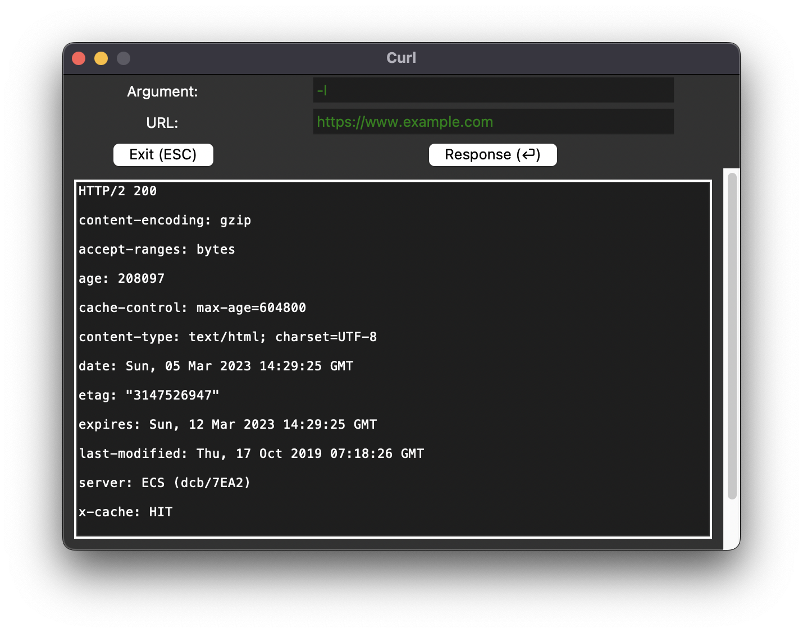
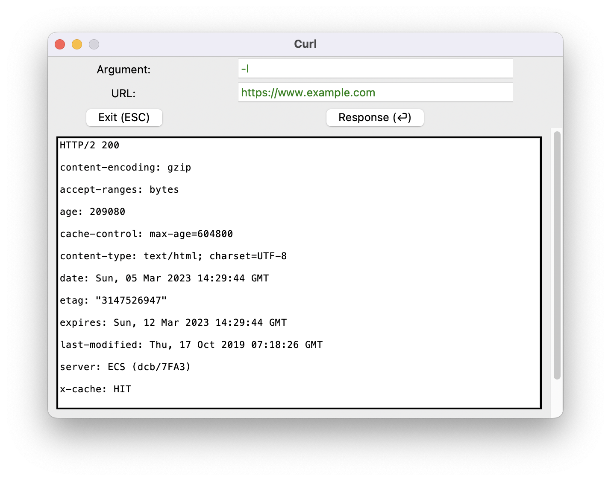

# Curl-GUI
## Description
This is a Python script that provides a simple graphical user interface for the curl command-line tool. The script uses the tkinter library to create a window with input fields for the curl command's arguments and URL. It also includes buttons to submit the command and display the response in a text area.
## Requirements
To run the script, you'll need to have Python 3 and the Curl installed on your system
### [Python 3](https://www.python.org/downloads/)
### [Curl](https://curl.se/docs/install.html)
## Screenshots
### Appearance-Dark:

### Appearance-White:

